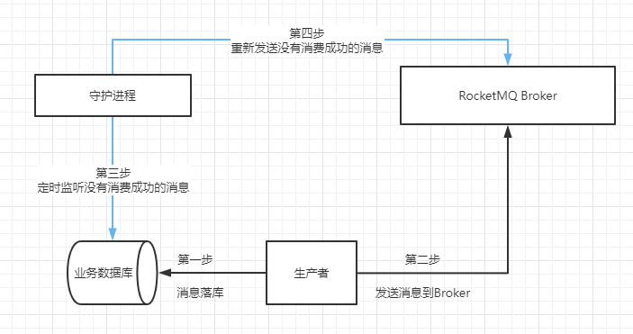

### 实现原理



### 安装

1. 下载组件包
   ```shell
   composer require lwz/laravel-mq
   ```
   
2. 发布配置文件

   > mq.php: 队列配置文件

   ```shell
   php artisan vendor:publish --provider="Lwz\LaravelExtend\MQ\MQServiceProvider"
   ```

   默认的日志驱动如下，如果需要配置，在配置文件 `logging.php` 的 `channels` 中对 `queuelog` 进行修改

   ```
   'queuelog' => [
       'driver' => 'daily',
       'path' => storage_path('logs/queue.log'),
       'level' => env('LOG_LEVEL', 'debug'),
       'days' => 50,
   ],
   ```

3. 创建基础表（**如果表已存在，跳过**）

   > mq_status_log：队列状态日志表
   >
   > mq_error_log：队列错误日志表

   ```shell
   php artisan migrate
   ```

4. 注册服务提供者 在 config/app.php 注册 ServiceProvider (Laravel 5.5 + 无需手动注册)
   ```php
   'providers' => [
        // ...
        Lwz\LaravelExtend\MQ\MQServiceProvider::class,
    ],
   ```
   
5. 队列日志驱动 `queuelog`，如果需要自定义在 `logging.php` 中新增 `queuelog` 驱动


### RocketMQ使用

> 目前只支持 RocketMQ

#### 1. 生产消息示例

````php
// 第一步：创建生产者对象
$mqObj = app(MQReliableProducerInterface::class,[
    'msg_tag' => '消息标签',
    'delay_time' => '延迟时间（可以不传 或 传 null）',
    'config_group' => '配置文件的分组名',
    'msg_key' => '消息唯一标识（如果没传会默认生成一个唯一字符串），如：订单号',
]);

DB::transaction(function () use ($mqObj) {
    // todo 业务代码
    // xxxxxxxx
    // 第二步：调用 publishPrepare() 方法，记录消息状态
    $data = []; // 需要推送到队列的数据
    $mqObj->publishPrepare($data);
});

// 第三步：将消息推送到队列中
$mqObj->publishMessage();
````

#### 2. 消费消息示例

> 注意：msg_tag 必须在 `mq.php` 配置文件中的`routes`指定消费类，否则消费失败

```shell
app(MQReliableConsumerAbstract::class, [
	'config_group' => 'xiansuo'
])->consumer();
```

#### 3. 消息幂等性处理

msg_tag 对应的消费类，需要实现 `callbacks(string $msgBody, string $msgKey)` 方法。

msgBody: 消息体

msgKey：消息唯一标识（可用于做幂等性处理）

### 守护进程，监听失败消息重新投递

> 由于所有消息都记录在同一张表里，因此只需要启动一个 进程 即可，否则会产生多次投递的问题

```shell
php artisan mq:reproduce
```

